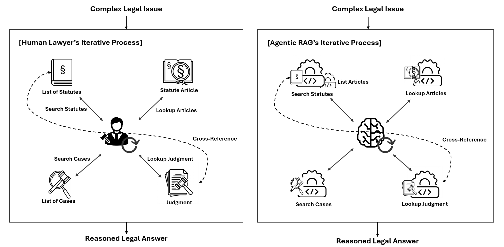

# Agentic RAG for Civil Law Systems

This repository contains the code and benchmark scripts for reproducibility.



*Comparison between a human lawyer's iterative research process (left) and the proposed agentic RAG system (right). Both follow a similar pattern: searching for relevant statutes and cases, then looking up full content. Cross-reference arrows indicate iterative refinement based on discovered legal sources.*

## Repository Structure

```
legal_mcp_repo/
├── legal_mcp/                    # MCP Server implementation
│   └── src/
│       ├── server.py             # Main FastMCP server
│       ├── config.py             # Configuration management
│       ├── elasticsearch/        # Elasticsearch client and queries
│       │   ├── client.py
│       │   └── queries.py
│       ├── tools/                # MCP tool implementations
│       │   ├── search_cases.py
│       │   ├── search_statutes.py
│       │   ├── get_case_content.py
│       │   ├── get_statute_content.py
│       │   └── list_statute_articles.py
│       └── utils/                # Utility functions
│           ├── embedding.py
│           ├── formatters.py
│           └── rrf_fusion.py
├── benchmark/                    # Benchmark scripts and results
│   ├── legal_close_book/         # Closed Book experiments
│   │   ├── benchmark.csv         # 150 Korean Bar Exam questions
│   │   ├── closed_book_benchmark_*.py
│   │   └── result/
│   ├── legal_naive_rag/          # Naïve RAG experiments
│   │   ├── rag_benchmark_*.py
│   │   └── result/
│   └── legal_mcp_rag/            # Agentic RAG experiments
│       ├── mcp_benchmark_*.py
│       └── result/
├── docs/                         # Documentation
│   ├── tools-spec.md             # MCP tool specifications
│   ├── config-spec.md            # Configuration documentation
│   └── elasticsearch-fields.md   # Index field documentation
├── requirements.txt
├── .env.example
└── README.md
```

## Dataset

The benchmark dataset and legal database are available on Hugging Face:

**[ducut91/legal_mcp](https://huggingface.co/datasets/ducut91/legal_mcp)**

The dataset includes:
- **Benchmark Questions**: 150 multiple-choice questions from the 14th Korean Bar Examination (2025)
  - Civil Law (민사법): 70 questions
  - Criminal Law (형사법): 40 questions
  - Public Law (공법): 40 questions
  - Source: [Ministry of Justice (법무부)](https://www.corrections.go.kr/bbs/moj/150/591294/artclView.do)
- **Court Cases**: 193,276 Korean court judgments (including 29,730 Constitutional Court decisions)
  - Source: [Korea Open Law Information (국가법령정보 공동활용)](https://open.law.go.kr)
- **Statutes**: 5,474 current Korean statutes with 200,633 individual articles
  - Source: [Korea Open Law Information (국가법령정보 공동활용)](https://open.law.go.kr)

All data is publicly available under Korean public data policies.

## MCP Server

### Public MCP Server

A public MCP server is available for testing:

```
https://mcp.crow-tit.com/sse
```

### Local Installation

1. Clone the repository:
```bash
git clone https://github.com/LimEulYoung/legal_mcp.git
cd legal_mcp
```

2. Install dependencies:
```bash
pip install -r requirements.txt
```

3. Configure environment variables:
```bash
cp .env.example .env
# Edit .env with your credentials
```

Required environment variables:
```
# Elasticsearch Configuration
ES_HOST=your_elasticsearch_host
ES_PORT=9200
ES_SCHEME=http
ES_USER=your_username
ES_PASSWORD=your_password

# Upstage API Configuration (REQUIRED for embeddings)
UPSTAGE_API_KEY=your_upstage_api_key

# Benchmark API Configuration
ANTHROPIC_API_KEY=your_anthropic_api_key
OPENAI_API_KEY=your_openai_api_key
GOOGLE_API_KEY=your_google_api_key
```

### MCP Tools

The server provides five tools for legal research:

| Tool | Description |
|------|-------------|
| `search_cases` | Search Korean court cases by keywords, with filters for court, date, and statute references |
| `get_case_content` | Retrieve full judgment text by case number |
| `search_statutes` | Search Korean statutes by name or legal concept |
| `get_statute_content` | Retrieve statute articles (full or specific articles) |
| `list_statute_articles` | List table of contents for a statute |

#### Quick Access Statute IDs

| Statute | ID | Statute | ID |
|---------|----|---------|----|
| Constitution (헌법) | 1444 | Framework Act on Administration (행정기본법) | 14041 |
| Civil Act (민법) | 1706 | Administrative Procedure Act (행정절차법) | 1362 |
| Commercial Act (상법) | 1702 | Administrative Litigation Act (행정소송법) | 1363 |
| Civil Procedure Act (민사소송법) | 1700 | Constitutional Court Act (헌법재판소법) | 11233 |
| Criminal Act (형법) | 1692 | | |
| Criminal Procedure Act (형사소송법) | 1671 | | |

## Running Benchmarks

### Prerequisites

1. Ensure you have the required API keys configured in `.env`
2. Download the benchmark dataset from Hugging Face or use the included `benchmark.csv`

### Command-Line Arguments

All benchmark scripts support the following arguments:

| Argument | Description | Default |
|----------|-------------|---------|
| `--limit` | Number of questions to run | All (150) |
| `--workers` | Number of parallel workers | 3 |

### Closed Book Benchmark

```bash
cd benchmark/legal_close_book

# Run all 150 questions
python closed_book_benchmark_gpt_5.1_high.py

# Run first 10 questions with 5 parallel workers
python closed_book_benchmark_gpt_5.1_high.py --limit 10 --workers 5

# Other models
python closed_book_benchmark_claude_sonnet_4.5_max_thinking.py
python closed_book_benchmark_gemini_2.5_high.py
```

### Naïve RAG Benchmark

```bash
cd benchmark/legal_naive_rag

# Run all 150 questions
python rag_benchmark_gpt_5.1_high.py

# Run first 10 questions with 5 parallel workers
python rag_benchmark_gpt_5.1_high.py --limit 10 --workers 5

# Other models
python rag_benchmark_claude_4.5_sonnet_max_thinking.py
python rag_benchmark_gemini_2.5_high.py
```

### Agentic RAG Benchmark (MCP)

```bash
cd benchmark/legal_mcp_rag

# Run all 150 questions
python mcp_benchmark_gpt_5.1_high.py

# Run first 10 questions with 5 parallel workers
python mcp_benchmark_gpt_5.1_high.py --limit 10 --workers 5

# Other models
python mcp_benchmark_claude_sonnet_4.5_max_thinking.py
python mcp_benchmark_gemini_2.5_pro_high.py

# Ablation study with explicit guidance
python mcp_benchmark_gemini_2.5_pro_high_guided.py
```

### Benchmark Results

Results are saved as JSON files in the `result/` subdirectory of each benchmark folder.

## Results Summary

### Overall Performance (Accuracy %)

Agentic RAG outperforms baselines for GPT and Claude, but Gemini shows performance degradation.

#### Closed Book

| Model | Total | Civil | Criminal | Public |
|-------|-------|-------|----------|--------|
| Claude 4.5 (Non-Think) | 46.67 | 45.71 | 45.00 | 50.00 |
| Claude 4.5 (Max-Think) | 51.33 | 45.71 | 52.50 | 60.00 |
| GPT-5.1 (None) | 43.33 | 48.57 | 37.50 | 40.00 |
| GPT-5.1 (Low) | 54.00 | 45.71 | 65.00 | 57.50 |
| GPT-5.1 (Medium) | 58.67 | 51.43 | 60.00 | 70.00 |
| GPT-5.1 (High) | 54.00 | 45.71 | 57.50 | 65.00 |
| Gemini 2.5 (Low) | 53.33 | 48.57 | 52.50 | 62.50 |
| Gemini 2.5 (High) | 60.67 | 55.71 | 65.00 | 65.00 |

#### Naïve RAG

| Model | Total | Civil | Criminal | Public |
|-------|-------|-------|----------|--------|
| Claude 4.5 (Non-Think) | 82.00 | 82.86 | 75.00 | 87.50 |
| Claude 4.5 (Max-Think) | 84.00 | 82.86 | 87.50 | 82.50 |
| GPT-5.1 (None) | 68.67 | 71.43 | 62.50 | 70.00 |
| GPT-5.1 (Low) | 77.33 | 81.43 | 77.50 | 70.00 |
| GPT-5.1 (Medium) | 84.67 | 84.29 | 82.50 | 87.50 |
| GPT-5.1 (High) | 86.00 | 82.86 | 90.00 | 87.50 |
| Gemini 2.5 (Low) | 82.67 | 85.71 | 80.00 | 80.00 |
| Gemini 2.5 (High) | **89.33** | 88.57 | **92.50** | 87.50 |

#### Agentic RAG (Ours)

| Model | Total | Civil | Criminal | Public |
|-------|-------|-------|----------|--------|
| Claude 4.5 (Non-Think) | 84.00 | 88.57 | 70.00 | 90.00 |
| Claude 4.5 (Max-Think) | **94.67** | 97.14 | 90.00 | **95.00** |
| GPT-5.1 (None) | 43.33 | 40.00 | 42.50 | 50.00 |
| GPT-5.1 (Low) | 82.00 | 81.43 | 77.50 | 87.50 |
| GPT-5.1 (Medium) | 95.33 | 98.57 | 90.00 | **95.00** |
| GPT-5.1 (High) | **96.67** | **100.00** | **92.50** | **95.00** |
| Gemini 2.5 (Low) | 81.33 | 85.71 | 75.00 | 80.00 |
| Gemini 2.5 (High) | 73.33 | 65.71 | 77.50 | 82.50 |

### Tool-Use Dynamics

Lookup Ratio = `get_case_content` / `search_cases` (measures deep exploration behavior)

| Model | Acc. | Δ Naïve | Avg Calls | search_cases | get_case | search_stat | get_stat | list_art | Lookup Ratio |
|-------|------|---------|-----------|--------------|----------|-------------|----------|----------|--------------|
| Claude 4.5 (Non-Think) | 84.00 | +2.00 | 11.15 | 891 | 416 | 92 | 268 | 5 | 46.7% |
| Claude 4.5 (Max-Think) | 94.67 | +10.67 | 10.29 | 837 | 355 | 80 | 264 | 7 | 42.4% |
| GPT-5.1 (None) | 43.33 | -25.33 | 2.27 | 154 | 1 | 82 | 103 | 0 | 0.6% |
| GPT-5.1 (Low) | 82.00 | +4.67 | 4.39 | 379 | 29 | 86 | 156 | 9 | 7.7% |
| GPT-5.1 (Medium) | 95.33 | +10.67 | 10.59 | 835 | 299 | 105 | 328 | 22 | 35.8% |
| GPT-5.1 (High) | 96.67 | +10.67 | 16.61 | 1,115 | **706** | 145 | 495 | 31 | **63.3%** |
| Gemini 2.5 (Low) | 81.33 | -1.34 | 4.40 | 480 | 0 | 48 | 124 | 8 | 0.0% |
| Gemini 2.5 (High) | 73.33 | -16.00 | 3.29 | 382 | 0 | 12 | 97 | 3 | 0.0% |

### Key Findings

Three distinct tool-use patterns were observed:

1. **Deep Exploration** (GPT-5.1)
   - Highest judgment lookup ratio (63.3%) correlates with best performance (96.67%)
   - Reasoning effort increase leads to systematic tool usage increase
   - GPT-5.1 (High) achieved **100% accuracy** on Civil Law questions

2. **Efficient Utilization** (Claude)
   - Achieves comparable accuracy (94.67%) with fewer lookups (42.4% ratio)
   - Similar tool usage between Non-Think and Max-Think modes
   - Performance difference comes from information utilization, not search depth

3. **Search-Lookup Disconnection** (Gemini)
   - Zero lookup ratio despite searching (0 `get_case_content` calls across all 150 questions)
   - Agentic RAG (73.33%) performs **worse** than Naïve RAG (89.33%)
   - Increasing reasoning effort actually **decreased** tool usage (4.40 → 3.29 avg calls)


## License

This project is licensed under the MIT License.
