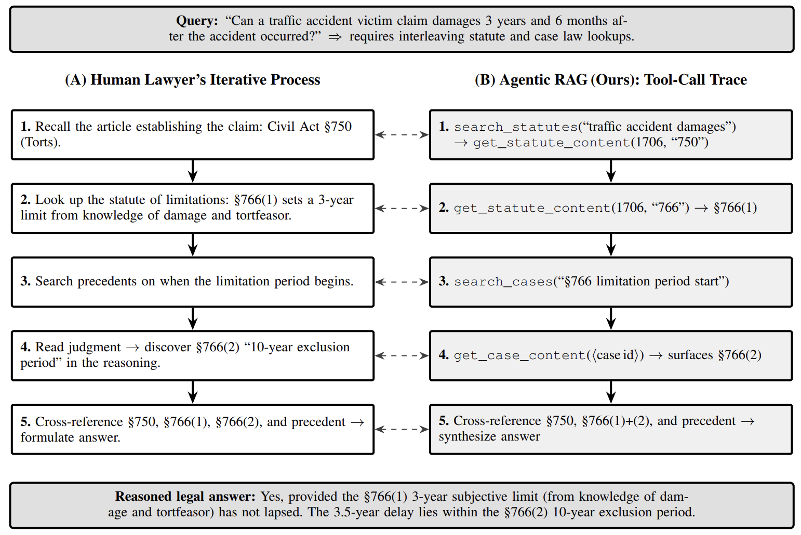

# Agentic RAG for Legal Question Answering in Civil Law

> **Agentic RAG for Legal Question Answering in Civil Law: Evidence from the Korean Bar Examination**
> Eul Young Lim and Jihun Park (under review)

This repository contains the code, benchmark scripts, and supplementary materials for reproducibility.

## Overview



*Parallel between (A) a human lawyer's iterative research workflow and (B) the proposed agentic RAG system, illustrated on a Civil Act §750/§766 traffic-accident query. Dashed arrows mark the step-by-step correspondence between the human process and the agentic tool-call trace.*

## Repository Structure

```
├── README.md
├── requirements.txt
├── .env.example
│
├── src/                      # MCP Server implementation
│   ├── server.py
│   ├── config.py
│   ├── elasticsearch/
│   ├── tools/
│   └── utils/
│
├── benchmark/
│   ├── scripts/              # Benchmark scripts (all experiments)
│   ├── results/              # Experiment results
│   │   ├── 2025/             #   2025 Bar Exam results
│   │   ├── 2026/             #   2026 Bar Exam results
│   │   └── ablation/         #   Ablation study results
│   ├── benchmark_2025.csv    # 2025 benchmark questions
│   └── benchmark_2026.csv    # 2026 benchmark questions
│
├── docs/                     # Documentation
│
└── assets/                   # Figures and images
```

## Dataset

| Data | Description | Source |
|------|-------------|--------|
| Benchmark Questions | 300 MCQs from 14th-15th Korean Bar Exam (2025-2026): Civil (140), Criminal (80), Public (80) | [Ministry of Justice](https://www.moj.go.kr) |
| Court Cases | 193,276 Korean court judgments (incl. 29,730 Constitutional Court decisions) | [Korea Open Law Information](https://open.law.go.kr) |
| Statutes | 5,474 current Korean statutes with 200,633 individual articles | [Korea Open Law Information](https://open.law.go.kr) |

## MCP Tools

The server provides five tools for legal research:

| Tool | Description |
|------|-------------|
| `search_cases` | Search Korean court cases by keywords, with filters for court, date, and statute references |
| `get_case_content` | Retrieve full judgment text by case number |
| `search_statutes` | Search Korean statutes by name or legal concept |
| `get_statute_content` | Retrieve statute articles (full or specific articles) |
| `list_statute_articles` | List table of contents for a statute |

**Running the MCP server (self-hosted):** after configuring Elasticsearch and API keys in `.env`, start the server with

```bash
MCP_TRANSPORT=sse python -m src.server   # SSE endpoint at http://localhost:8000/sse
```

The benchmark scripts read the endpoint from the `MCP_SERVER_URL` environment variable (default: `http://localhost:8000/sse`).

### Quick Access Statute IDs

| Statute | ID | Statute | ID |
|---------|----|---------|----|
| Constitution | 1444 | Framework Act on Administration | 14041 |
| Civil Act | 1706 | Administrative Procedure Act | 1362 |
| Commercial Act | 1702 | Administrative Litigation Act | 1363 |
| Civil Procedure Act | 1700 | Constitutional Court Act | 11233 |
| Criminal Act | 1692 | | |
| Criminal Procedure Act | 1671 | | |

## Running Benchmarks

### Prerequisites

1. Configure API keys and endpoints in `.env` (see `.env.example`)
2. Install dependencies: `pip install -r requirements.txt`
3. For agentic RAG and ablation experiments, start the MCP server (see above) or set `MCP_SERVER_URL` to a running instance

### Benchmark Scripts

All scripts are located in `benchmark/scripts/` and share common parameters: `--model`, `--effort`, `--workers`, `--limit`, `--csv`, `--output`. Use `--help` for details.

| Experiment | Claude (Anthropic API) | GPT (OpenAI API) | Gemini (Google GenAI API) |
|------------|----------------------|-------------------|--------------------------|
| Closed Book | `closed_book_benchmark_claude.py` | `closed_book_benchmark_gpt.py` | `closed_book_benchmark_gemini.py` |
| Naïve RAG (dense) | `rag_benchmark_claude.py` | `rag_benchmark_gpt.py` | `rag_benchmark_gemini.py` |
| Naïve RAG (hybrid, controlled comparison) | `rag_benchmark_hybrid_claude.py` | `rag_benchmark_hybrid_gpt.py` | `rag_benchmark_hybrid_gemini.py` |
| Agentic RAG | `mcp_benchmark_claude.py` | `mcp_benchmark_gpt.py` | `mcp_benchmark_gemini.py` |
| Ablation | `ablation_claude.py` | `ablation_gpt.py` | `ablation_gemini.py` |
| Prompt Guidance | — | — | `mcp_benchmark_gemini_guided_high.py`, `mcp_benchmark_gemini_guided_low.py` |

**Model-specific notes:**
- **Claude**: `--effort` none/low/medium/high/max, MCP uses beta API
- **GPT**: OpenAI Responses API, `--effort` none/low/medium/high
- **Gemini**: async structure (asyncio); `--effort low/high` maps to thinking budgets 128/32768, or set the budget directly with `--thinking-budget {128, 512, 2048, 8192, 32768}` (overrides `--effort`; used for the five-budget sweep)

### Examples

```bash
# Closed Book
python benchmark/scripts/closed_book_benchmark_gpt.py --model gpt-5.1 --effort high --limit 10 --workers 3

# Naïve RAG (dense retrieval — main-text baseline)
python benchmark/scripts/rag_benchmark_claude.py --model claude-sonnet-4-5-20250929 --effort max --workers 2

# Naïve RAG with the agent's retrieval (hybrid + full texts) — controlled comparison
python benchmark/scripts/rag_benchmark_hybrid_gemini.py --model gemini-2.5-pro --thinking-budget 512 --granularity full --workers 3

# Agentic RAG (Ours) — Gemini thinking-budget sweep
python benchmark/scripts/mcp_benchmark_gemini.py --model gemini-2.5-pro --thinking-budget 8192 --workers 3

# Ablation (tool combination)
python benchmark/scripts/ablation_gpt.py --condition case_only --model gpt-5.1 --effort high --workers 3
```

### Controlled Comparison: Retrieval Method and Document Granularity

The `rag_benchmark_hybrid_*.py` scripts equip the Naïve RAG baseline with the agent's retrieval configuration (paper, Appendix D):

- Hybrid retrieval: field-boosted BM25 + dense KNN, fused with RRF (k=60, BM25 weight 1.05, vector weight 1.0), top-10
- `--granularity summary` (judgment summaries, 2,000 chars) or `--granularity full` (full judgment texts, top 5, 5,000 chars)

### Ablation: Tool Combination

The `--condition` parameter controls which MCP tools are available:

| Condition | Description | Tools Available |
|-----------|-------------|-----------------|
| `full` | All tools (control) | search_cases, get_case_content, search_statutes, get_statute_content, list_statute_articles (5) |
| `no_case_content` | No case full-text lookup | search_cases, search_statutes, get_statute_content, list_statute_articles (4) |
| `statute_only` | Statute tools only | search_statutes, get_statute_content, list_statute_articles (3) |
| `case_only` | Case search only (summary) | search_cases (1) |

### Prompt Guidance Experiment (Gemini)

Gemini exhibited Tool Aversion under agentic RAG. These scripts test whether explicit tool-use guidance in the prompt can mitigate it. The thinking budget is fixed per script (`_high` = 32768, `_low` = 128), with `--limit` and `--workers` supported.

```bash
# Gemini 2.5 Pro with guided prompt (thinking budget 32768)
python benchmark/scripts/mcp_benchmark_gemini_guided_high.py --workers 3

# Gemini 2.5 Pro with guided prompt (thinking budget 128)
python benchmark/scripts/mcp_benchmark_gemini_guided_low.py --workers 3
```

## Results Summary

### Overall Performance (Accuracy %, N=300, 2025-2026 Korean Bar Exam)

| Model | Closed Book | Naïve RAG | Agentic RAG |
|-------|-------------|-----------|-------------|
| Claude Sonnet 4.5 (Max-Think) | 54.00 | 82.67 | **92.67** |
| GPT-5.1 (High) | 50.00 | 83.67 | **95.33** |
| Gemini 2.5 Pro (thinking budget 32768) | 64.33 | **90.33** | 75.67 |

### Gemini Thinking-Budget Sweep (Tool Aversion)

| Thinking budget | Naïve RAG | Agentic RAG | Avg tool calls | Zero-call questions |
|----------------:|----------:|------------:|---------------:|--------------------:|
| 128 | 84.67 | 83.00 | 4.29 | 24 |
| 512 | 83.67 | 83.67 | 4.84 | 2 |
| 2048 | 85.67 | 79.67 | 3.50 | 28 |
| 8192 | 88.33 | 77.33 | 3.23 | 30 |
| 32768 | **90.33** | 75.67 | 2.98 | 30 |

Beyond the smallest budget, average tool calls fall monotonically and agentic accuracy declines in parallel, while the Naïve RAG baseline rises — larger reasoning budgets are associated with less tool use rather than more.

### Controlled Comparison: Retrieval Method and Document Granularity (Accuracy %, N=300)

Dense = dense KNN + case summaries (main-text Naïve RAG); Hybrid-Sum = hybrid retrieval + summaries; Hybrid-Full = hybrid retrieval + full judgment texts (top 5). Agentic RAG uses the same hybrid search and full-text access. **Bold**: best per row.

| Model | Level | Dense | Hybrid-Sum | Hybrid-Full | Agentic |
|-------|-------|------:|-----------:|------------:|--------:|
| GPT-5.1 | None | **69.00** | 67.67 | **69.00** | 48.67 |
| | Low | 78.00 | 77.00 | 77.00 | **82.00** |
| | Medium | 82.00 | 79.33 | 81.00 | **95.33** |
| | High | 83.67 | 79.00 | 83.33 | **95.33** |
| Claude 4.5 | Non-Think | 77.67 | 74.33 | 75.33 | **85.00** |
| | Max-Think | 82.67 | 78.67 | 79.67 | **92.67** |
| Gemini 2.5 | 128 | **84.67** | 82.67 | 81.00 | 83.00 |
| | 512 | **83.67** | 82.00 | 83.33 | **83.67** |
| | 2048 | 85.67 | **86.33** | 84.33 | 79.67 |
| | 8192 | 88.33 | **90.33** | 89.00 | 77.33 |
| | 32768 | **90.33** | 89.33 | 89.00 | 75.67 |

### Key Findings

| Pattern | Model | Observation |
|---------|-------|-------------|
| **Intensive Tool Use** | GPT-5.1 | 15.37 avg tool calls, highest accuracy (95.33%) |
| **Efficient Utilization** | Claude | 10.18 avg tool calls, 92.67% accuracy — reasoning depth over retrieval volume |
| **Tool Aversion** | Gemini | 2.98 avg tool calls, 10% zero-call questions → worse than Naïve RAG |

**File naming note:** Gemini result files are labeled by thinking budget (e.g., `budget128`, `budget32768`). These correspond to the `low` (=128) and `high`/`max` (=32768) labels used in earlier revisions of this repository.

## License

This project is licensed under the MIT License.
