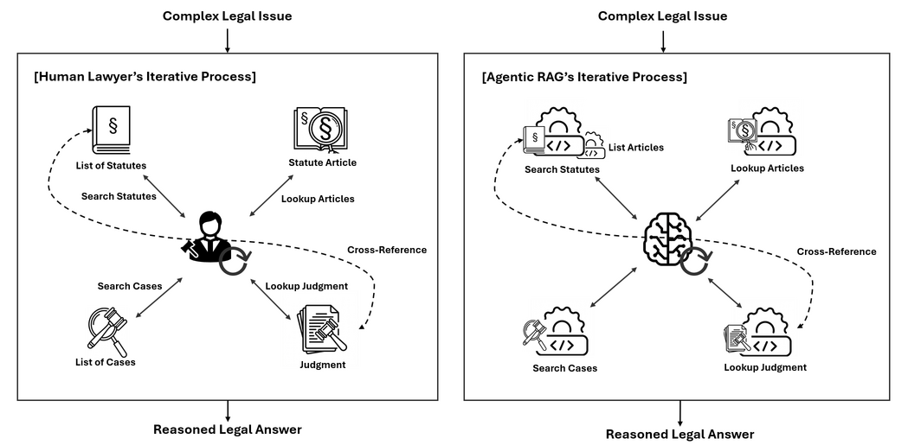

# Agentic RAG for Civil Law Systems

This repository contains the code, benchmark scripts, and supplementary materials for reproducibility.

## Overview



*Comparison between a human lawyer's iterative research process (left) and the proposed agentic RAG system (right). Both follow a similar pattern: searching for relevant statutes and cases, then looking up full content.*

## Repository Structure

```
├── README.md
├── appendix.pdf              # Full paper appendix
├── requirements.txt
├── .env.example
│
├── src/                      # MCP Server implementation
│   ├── server.py
│   ├── config.py
│   ├── elasticsearch/
│   ├── tools/
│   └── utils/
│
├── benchmark/
│   ├── scripts/              # Benchmark scripts (all experiments)
│   ├── results/              # Experiment results
│   │   ├── 2025/             #   2025 Bar Exam results
│   │   ├── 2026/             #   2026 Bar Exam results
│   │   └── ablation/         #   Ablation study results
│   ├── benchmark_2025.csv    # 2025 benchmark questions
│   └── benchmark_2026.csv    # 2026 benchmark questions
│
├── docs/                     # Documentation
│
└── assets/                   # Figures and images
```

## Dataset

| Data | Description | Source |
|------|-------------|--------|
| Benchmark Questions | 150 MCQs from 14th Korean Bar Exam (2025): Civil (70), Criminal (40), Public (40) | [Ministry of Justice](https://www.corrections.go.kr/bbs/moj/150/591294/artclView.do) |
| Court Cases | 193,276 Korean court judgments (incl. 29,730 Constitutional Court decisions) | [Korea Open Law Information](https://open.law.go.kr) |
| Statutes | 5,474 current Korean statutes with 200,633 individual articles | [Korea Open Law Information](https://open.law.go.kr) |

## MCP Tools

The server provides five tools for legal research:

| Tool | Description |
|------|-------------|
| `search_cases` | Search Korean court cases by keywords, with filters for court, date, and statute references |
| `get_case_content` | Retrieve full judgment text by case number |
| `search_statutes` | Search Korean statutes by name or legal concept |
| `get_statute_content` | Retrieve statute articles (full or specific articles) |
| `list_statute_articles` | List table of contents for a statute |

### Quick Access Statute IDs

| Statute | ID | Statute | ID |
|---------|----|---------|----|
| Constitution | 1444 | Framework Act on Administration | 14041 |
| Civil Act | 1706 | Administrative Procedure Act | 1362 |
| Commercial Act | 1702 | Administrative Litigation Act | 1363 |
| Civil Procedure Act | 1700 | Constitutional Court Act | 11233 |
| Criminal Act | 1692 | | |
| Criminal Procedure Act | 1671 | | |

## Running Benchmarks

### Prerequisites

1. Configure API keys in `.env` (see `.env.example`)
2. Install dependencies: `pip install -r requirements.txt`

### Benchmark Scripts

All scripts are located in `benchmark/scripts/` and share common parameters: `--model`, `--effort`, `--workers`, `--limit`, `--csv`, `--output`. Use `--help` for details.

| Experiment | Claude (Anthropic API) | GPT (OpenAI API) | Gemini (Google GenAI API) |
|------------|----------------------|-------------------|--------------------------|
| Closed Book | `closed_book_benchmark_claude.py` | `closed_book_benchmark_gpt.py` | `closed_book_benchmark_gemini.py` |
| Naïve RAG | `rag_benchmark_claude.py` | `rag_benchmark_gpt.py` | `rag_benchmark_gemini.py` |
| Agentic RAG | `mcp_benchmark_claude.py` | `mcp_benchmark_gpt.py` | `mcp_benchmark_gemini.py` |
| Ablation | `ablation_claude.py` | `ablation_gpt.py` | `ablation_gemini.py` |

**Model-specific notes:**
- **Claude**: `--effort` none/low/medium/high/max, MCP uses beta API
- **GPT**: OpenAI Responses API, `--effort` none/low/medium/high
- **Gemini**: async structure (asyncio), `--effort` low/medium/high/max

### Examples

```bash
# Closed Book
python benchmark/scripts/closed_book_benchmark_gpt.py --model gpt-5.1 --effort high --limit 10 --workers 3

# Naïve RAG
python benchmark/scripts/rag_benchmark_claude.py --model claude-sonnet-4-5-20250929 --effort max --workers 2

# Agentic RAG (Ours)
python benchmark/scripts/mcp_benchmark_gemini.py --model gemini-2.5-pro --effort high --workers 3

# Ablation (tool combination)
python benchmark/scripts/ablation_gpt.py --condition case_only --model gpt-5.1 --effort high --workers 3
```

### Ablation: Tool Combination

The `--condition` parameter controls which MCP tools are available:

| Condition | Description | Tools Available |
|-----------|-------------|-----------------|
| `full` | All tools (control) | search_cases, get_case_content, search_statutes, get_statute_content, list_statute_articles (5) |
| `no_case_content` | No case full-text lookup | search_cases, search_statutes, get_statute_content, list_statute_articles (4) |
| `statute_only` | Statute tools only | search_statutes, get_statute_content, list_statute_articles (3) |
| `case_only` | Case search only (summary) | search_cases (1) |

## Results Summary

### Overall Performance (Accuracy %, N=300, 2025-2026 Korean Bar Exam)

| Model | Closed Book | Naïve RAG | Agentic RAG |
|-------|-------------|-----------|-------------|
| Claude Sonnet 4.5 (Max-Think) | 54.00 | 82.67 | **92.67** |
| GPT-5.1 (High) | 50.00 | 83.67 | **95.33** |
| Gemini 2.5 Pro (High) | 64.33 | **90.33** | 75.67 |

### Key Findings

| Pattern | Model | Observation |
|---------|-------|-------------|
| **Intensive Tool Use** | GPT-5.1 | 15.37 avg tool calls, highest accuracy (95.33%) |
| **Efficient Utilization** | Claude | 10.18 avg tool calls, 92.67% accuracy — reasoning depth over retrieval volume |
| **Tool Aversion** | Gemini | 2.98 avg tool calls, 10% zero-call questions → worse than Naïve RAG |


## License

This project is licensed under the MIT License.
